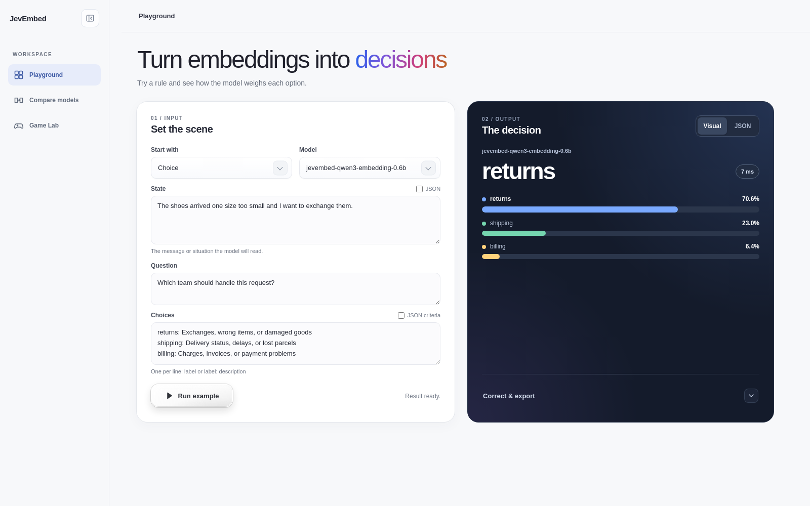

# JevEmbed


**Meet JevEmbed — turn embeddings into decisions**

*Choose, score, and judge with your choice of embedding model.*

JevEmbed is a Python framework that turns embedding models into structured decision engines for Choice, Score, and Noul tasks. It offers a consistent Jev-style interface through a Python API, CLI, and optional HTTP server.

## News

- **September 29, 2026:** Added a versioned [benchmark module](docs/benchmark.md) with multi-file JSONL cases, unified Choice/Score/Noul evaluation, and structured JSON results.
- **September 28, 2026:** Released [JevEmbed-Qwen3-Embedding-4B](https://huggingface.co/HIT-TMG/JevEmbed-Qwen3-Embedding-4B), fine-tuned on JevEmbed-Data, with merged weights and a LoRA adapter.
- **September 27, 2026:** Added an interactive [Playground](docs/playground.md) with model comparison and Game Lab.
- **September 26, 2026:** Added [supervised data synthesis](docs/synthesis.md) for Choice, Score, and Noul, with configurable label quotas.
- **September 26, 2026:** JevEmbed now includes ready-to-use configurations for [JevEmbed-Qwen3-Embedding-0.6B](https://huggingface.co/HIT-TMG/JevEmbed-Qwen3-Embedding-0.6B) and [JevEmbed-KaLM-Embedding-V2.5](https://huggingface.co/HIT-TMG/JevEmbed-KaLM-Embedding-V2.5).
- **September 25, 2026:** [JevEmbed-KaLM-Embedding-V2.5](https://huggingface.co/HIT-TMG/JevEmbed-KaLM-Embedding-V2.5) is available on Hugging Face with merged weights and a LoRA adapter.
- **September 24, 2026:** JevEmbed now supports [CLM-v0.1-8B](https://huggingface.co/Contrastive-LM/CLM-v0.1-8B) for Choice, Score, and Noul decisions. See the [CLM-v0.1-8B setup guide](docs/clm.md).
- **September 24, 2026:** [JevEmbed-Data](https://huggingface.co/datasets/HIT-TMG/JevEmbed-Data) is available for fine-tuning, with 1.67 million labeled Choice, Score, and Noul questions.

## Playground

Explore Choice, Score, and Noul decisions in the browser, compare models, inspect JSON results, and try model-controlled pixel games in Game Lab.



Run `python -m jevembed --playground`, then open `http://127.0.0.1:8000/playground/`. See the [Playground guide](docs/playground.md) for model configuration and usage.

## Installation

Use Python 3.10–3.12 for the tested model stack. Run these commands from the project root:

```bash
python -m venv .venv
source .venv/bin/activate
# Windows PowerShell: .venv\Scripts\Activate.ps1
python -m pip install -r requirements.txt
python -m pip install -e . --no-deps
```

`requirements.txt` includes local inference and HTTP dependencies with the constraints in `requirements-models-tested.txt`. Contributors can install `requirements-dev.txt` for testing and packaging. See [dependency compatibility](docs/compatibility.md#dependencies) for package roles and tested versions.

For a minimal installation, select the required optional dependencies:

```bash
python -m pip install -e .                        # Core, configuration, and explain
python -m pip install -e '.[http,server]'          # HTTP backend and API
python -m pip install -e '.[local]' -c requirements-models-tested.txt
python -m pip install -r requirements-dev.txt     # Tests and builds, without model libraries
```

Core imports and `--explain` require no model weights or service.

## Supported models

Configurations use Hugging Face repository IDs; weights download on first inference if absent from the local cache.

| JevEmbed ID / configuration filename | Weight repository | Dimensions | Token limit | Pooling |
| --- | --- | --- | --- | --- |
| `kalm-embedding-v2.5` | `KaLM-Embedding/KaLM-embedding-multilingual-mini-instruct-v2.5` | 896 | 32768 | Mean |
| `qwen3-embedding-0.6b` | `Qwen/Qwen3-Embedding-0.6B` | 1024 | 32768 | Last-token |
| `qwen3-embedding-4b` | `Qwen/Qwen3-Embedding-4B` | 2560 | 32768 | Last-token |
| `qwen3-embedding-8b` | `Qwen/Qwen3-Embedding-8B` | 4096 | 32768 | Last-token |
| `multilingual-e5-large-instruct` | `intfloat/multilingual-e5-large-instruct` | 1024 | 512 | Mean |
| `clm-v0.1-8b` | `Contrastive-LM/CLM-v0.1-8B` projection heads + `Qwen/Qwen3-8B` encoder | 512 | 2048 | Last-token + paired heads |
| [`jevembed-kalm-embedding-v2.5`](configs/jevembed-kalm-embedding-v2.5.yaml) | [HIT-TMG/JevEmbed-KaLM-Embedding-V2.5](https://huggingface.co/HIT-TMG/JevEmbed-KaLM-Embedding-V2.5) | 896 | 1024 | Mean |
| [`jevembed-qwen3-embedding-0.6b`](configs/jevembed-qwen3-embedding-0.6b.yaml) | [HIT-TMG/JevEmbed-Qwen3-Embedding-0.6B](https://huggingface.co/HIT-TMG/JevEmbed-Qwen3-Embedding-0.6B) | 1024 | 1024 | Last-token |
| [`jevembed-qwen3-embedding-4b`](configs/jevembed-qwen3-embedding-4b.yaml) | [HIT-TMG/JevEmbed-Qwen3-Embedding-4B](https://huggingface.co/HIT-TMG/JevEmbed-Qwen3-Embedding-4B) | 2560 | 1024 | Last-token |

Configurations are in `configs/<model-id>.yaml`. Repository IDs work as aliases; responses use the short ID. Unknown IDs, including `jev-latest`, are rejected.

The JevEmbed releases are fine-tuned for Choice, Score, and Noul and use 1,024-token truncation.

KaLM-embedding-multilingual-mini-instruct-v2.5 requires `trust_remote_code: true`. Qwen3-Embedding-0.6B, Qwen3-Embedding-4B, Qwen3-Embedding-8B, multilingual-e5-large-instruct, and CLM-v0.1-8B use `false`. Loading failures do not change trust or pooling settings. Pin revisions and dependency versions to reproduce results.

CLM-v0.1-8B uses separate state/action projections and [model-specific prompts](configs/clm-v0.1-8b.yaml), with Choice/Score temperature 0.01 and Noul slope 100. See the [CLM-v0.1-8B guide](docs/clm.md).

## Quick start

```bash
python -m jevembed --config configs/kalm-embedding-v2.5.yaml \
  --input examples/official_choice_exchange.json
```

Repeat `--config` for multiple models and set the request's `model` field to the selected ID. `--input -` reads standard input.

For JevEmbed-Qwen3-Embedding-0.6B, use `--config configs/jevembed-qwen3-embedding-0.6b.yaml` with `"model": "jevembed-qwen3-embedding-0.6b"`. JevEmbed-KaLM-Embedding-V2.5 uses its [configuration](configs/jevembed-kalm-embedding-v2.5.yaml) and `jevembed-kalm-embedding-v2.5` ID.

For JevEmbed-Qwen3-Embedding-4B, use `--config configs/jevembed-qwen3-embedding-4b.yaml` with `"model": "jevembed-qwen3-embedding-4b"`; `HIT-TMG/JevEmbed-Qwen3-Embedding-4B` and `JevEmbed-Qwen3-Embedding-4B` are aliases.

The shared [examples](examples/README.md) cover all three tasks. To try another model, replace `"model": "kalm-embedding-v2.5"` in the request and select the matching configuration. The [local runner](scripts/run_local.sh) is available for source checkouts.

## Official Jev examples

The official Choice, Score, and Noul requests, saved Jev reference outputs, and KaLM-embedding-multilingual-mini-instruct-v2.5 predictions are documented in [official examples and scoring](docs/examples-and-scoring.md).

## Local weights and offline use

Copy a public configuration into the ignored `configs/local/` directory:

```bash
mkdir -p configs/local
cp configs/kalm-embedding-v2.5.yaml configs/local/kalm.yaml
```

Set the model directory and offline loading policy in the copied configuration:

```yaml
model_name_or_path: ./models/KaLM-embedding-multilingual-mini-instruct-v2.5
local_files_only: true
```

Relative paths resolve from the command's working directory. Run with `--config configs/local/kalm.yaml`. You can also set `HF_HUB_OFFLINE=1` for offline operation. `models/`, `configs/local/`, `*.local.yaml`, `.env`, and `artifacts/` are ignored by Git for local weights, configuration, and outputs.

## Python API

```python
import json
from jevembed import JevEmbed, ModelConfig

client = JevEmbed()
client.register(ModelConfig.load("configs/kalm-embedding-v2.5.yaml"))
client.register(ModelConfig.load("configs/qwen3-embedding-0.6b.yaml"))

with open("examples/official_noul_escalation.json", encoding="utf-8") as handle:
    request = json.load(handle)

compiled = client.explain(request)            # No model loading
response = client.evaluate(request)           # A plain dictionary
result = client.evaluate_with_trace(request)  # {"response": ..., "trace": ...}

request["model"] = "qwen3-embedding-0.6b"
response = client.evaluate(request)

# Python calls can omit model and use the first registered model
response = client.system_one(state="hello", questions={
    "greeting": {"type": "choice", "instructions": "Classify the message.",
                 "criteria": {"greeting": "A greeting", "other": "Other content"}}
})
client.clear_cache()
```

Custom backends implement `encode(list[EmbeddingInput]) -> EmbeddingBatch` and can be injected with `JevEmbed(backend=backend, model="my-model")`. Each input carries a role, instruction, and text. The backend renders its template and returns vectors and per-call token usage. The core handles deduplication, normalization, and scoring. Use `confidence_estimator` to supply a custom confidence function.

## Input mapping and scoring

JevEmbed compiles each primitive into embedding inputs, cosine similarities, and a task-specific scoring rule. See [official examples and scoring](docs/examples-and-scoring.md#input-mapping-and-scoring) for rendered inputs, formulas, and worked cases.

## HTTP interfaces

```bash
python -m jevembed --config configs/kalm-embedding-v2.5.yaml --serve
```

The server binds to `127.0.0.1:8000` and provides `POST /v1/systemone` and `GET /v1/models`. HTTP requests require `model`; validation errors return 422 and backend failures 502. Per process, the defaults are 2 MiB, 64 questions, 4096 embedding inputs, four active requests, and a 30-second body read timeout. Size or work violations return 413, excess concurrency 429, and slow uploads 408. The [HTTP guide](docs/http.md) has `curl` and Python examples; [serving limits](docs/runtime.md#http-serving-limits) covers options and concurrency.

Use [http-example.yaml](configs/http-example.yaml) to connect to an embeddings service. Templates are rendered by the client; the service must enforce input length before `server_enforces_length: true` is set. The [HTTP guide](docs/http.md#call-an-external-embeddings-service) explains this separate backend.

## Benchmarking

Run versioned Choice, Score, and Noul JSONL benchmarks with one or more model configurations. The runner writes per-model `results.json`, an optional `predictions.jsonl`, and a comparison `summary.json`:

```bash
jevembed-benchmark --benchmark examples/benchmark/benchmark.json \
  --config configs/jevembed-qwen3-embedding-0.6b.yaml --output results
```

The [benchmark guide](docs/benchmark.md) defines the input format, targets, metrics, and result layout.

## LoRA fine-tuning

JevEmbed fine-tunes Sentence Transformers encoders on Choice, Score, and Noul supervision, including soft targets. The released [JevEmbed-KaLM-Embedding-V2.5](https://huggingface.co/HIT-TMG/JevEmbed-KaLM-Embedding-V2.5), [JevEmbed-Qwen3-Embedding-0.6B](https://huggingface.co/HIT-TMG/JevEmbed-Qwen3-Embedding-0.6B), and [JevEmbed-Qwen3-Embedding-4B](https://huggingface.co/HIT-TMG/JevEmbed-Qwen3-Embedding-4B) models each trained for **one epoch on all 1,601,157 JevEmbed-Data training questions**, then had their LoRA weights merged into standalone models. All three used:

- BF16 and an effective batch of **512 questions**;
- LoRA rank **64**, alpha **32**, dropout **0.05**, and `q_proj`/`k_proj`/`v_proj` targets;
- learning rate **2 × 10⁻⁴** with **10% warmup** and **1,024-token truncation**;
- Choice/Score temperature **0.1** and Noul slope **10** in the [KaLM-embedding-multilingual-mini-instruct-v2.5](configs/kalm-embedding-v2.5.yaml) and [Qwen3-Embedding-0.6B](configs/qwen3-embedding-0.6b.yaml) base configurations.

Install the training extra with `python -m pip install -e '.[train]' -c requirements-models-tested.txt`. The trainer reads supervised JSONL, so convert the dataset's `train` Parquet rows to the [documented JSONL schema](docs/training.md#supervision-format-and-objectives) and reserve `test` for final evaluation. The [training guide](docs/training.md) covers commands, validation, and adapter inference; the model cards give each release's exact settings.

On the held-out JevEmbed-Data `test` split, overall hard-label accuracy covers **64,110** of **66,482** questions:

| Model | Base | After JevEmbed-Data fine-tuning | Change |
| --- | ---: | ---: | ---: |
| `KaLM-Embedding/KaLM-embedding-multilingual-mini-instruct-v2.5` | 32.33% | 76.03% | +43.70 pp |
| `Qwen/Qwen3-Embedding-0.6B` | 33.79% | 82.30% | +48.51 pp |
| `Qwen/Qwen3-Embedding-4B` | 36.29% | **85.86%** | +49.57 pp |

The [full test report](reports/JEVEMBED_DATA_TEST.md) gives Choice, Score, and Noul accuracy and error metrics.

## Synthetic training data

The [synthesis guide](docs/synthesis.md) shows how to generate hard-labeled Choice, Score, or Noul JSONL for a fixed question using an OpenAI-compatible teacher. It includes four example configs, schema checks, configurable label quotas, a separate teacher label check, optional trusted reference rules, and resumable output. Review the generated data before using it with the trainer.

## Development and validation

```bash
python -m pip install -r requirements-dev.txt
python -m pytest -q

# Build a wheel and source distribution
python -m build
```

Tests use fixtures and mock models without downloading weights. Save generated traces under the ignored `artifacts/` directory.

## JevEmbed-Data test results

The six base models and three JevEmbed releases were evaluated on the same **66,482-question** [JevEmbed-Data](https://huggingface.co/datasets/HIT-TMG/JevEmbed-Data) `test` split. Runs used BF16, each model's configured prompts and scoring, and truncation at 1,024 tokens for KaLM-embedding-multilingual-mini-instruct-v2.5, Qwen3-Embedding-0.6B, Qwen3-Embedding-4B, Qwen3-Embedding-8B, and all three JevEmbed releases; 512 for multilingual-e5-large-instruct; and 2,048 for CLM-v0.1-8B. Accuracy covers **64,110 hard-labeled** questions; soft labels are excluded. The released models used the JevEmbed-Data training split; the base rows show original weights.

| Model | Choice (17,487) | Score (24,260) | Noul (22,363) | Overall (64,110) |
| --- | ---: | ---: | ---: | ---: |
| `KaLM-Embedding/KaLM-embedding-multilingual-mini-instruct-v2.5` | 28.61% | 27.45% | 40.52% | 32.33% |
| `Qwen/Qwen3-Embedding-0.6B` | 33.02% | 28.56% | 40.05% | 33.79% |
| `Qwen/Qwen3-Embedding-4B` | 38.11% | 30.55% | 41.09% | 36.29% |
| `Qwen/Qwen3-Embedding-8B` | 43.20% | 33.49% | 42.57% | 39.30% |
| `intfloat/multilingual-e5-large-instruct` | 32.07% | 24.27% | 40.54% | 32.07% |
| `Contrastive-LM/CLM-v0.1-8B` | 28.59% | 25.85% | 53.74% | 36.33% |
| [JevEmbed-KaLM-Embedding-V2.5](https://huggingface.co/HIT-TMG/JevEmbed-KaLM-Embedding-V2.5) | 71.05% | 66.17% | 90.61% | 76.03% |
| [JevEmbed-Qwen3-Embedding-0.6B](https://huggingface.co/HIT-TMG/JevEmbed-Qwen3-Embedding-0.6B) | 84.53% | 69.55% | 94.38% | **82.30%** |
| [JevEmbed-Qwen3-Embedding-4B](https://huggingface.co/HIT-TMG/JevEmbed-Qwen3-Embedding-4B) | 90.31% | 73.41% | 95.88% | **85.86%** |

The [full test report](reports/JEVEMBED_DATA_TEST.md) gives the error metrics, denominators, and evaluation command.

See the [compatibility boundaries](docs/compatibility.md) and [architecture and design](docs/design.md) for the implementation contract.

## Acknowledgments

JevEmbed uses [Sentence Transformers](https://www.sbert.net/) for model loading and embedding inference. We thank its maintainers and contributors for the library and its support for the embedding community.

## Citation

If you find JevEmbed useful, please consider citing the following papers:

```bibtex
@misc{zhao2025kalmembeddingv2,
      title={KaLM-Embedding-V2: Superior Training Techniques and Data Inspire A Versatile Embedding Model},
      author={Xinping Zhao and Xinshuo Hu and Zifei Shan and Shouzheng Huang and Yao Zhou and Xin Zhang and Zetian Sun and Zhenyu Liu and Dongfang Li and Xinyuan Wei and Youcheng Pan and Yang Xiang and Meishan Zhang and Haofen Wang and Jun Yu and Baotian Hu and Min Zhang},
      year={2025},
      eprint={2506.20923},
      archivePrefix={arXiv},
      primaryClass={cs.CL},
      url={https://arxiv.org/abs/2506.20923},
}

@misc{hu2025kalmembedding,
      title={KaLM-Embedding: Superior Training Data Brings A Stronger Embedding Model},
      author={Xinshuo Hu and Zifei Shan and Xinping Zhao and Zetian Sun and Zhenyu Liu and Dongfang Li and Shaolin Ye and Xinyuan Wei and Qian Chen and Baotian Hu and Haofen Wang and Jun Yu and Min Zhang},
      year={2025},
      eprint={2501.01028},
      archivePrefix={arXiv},
      primaryClass={cs.CL},
      url={https://arxiv.org/abs/2501.01028},
}
```
